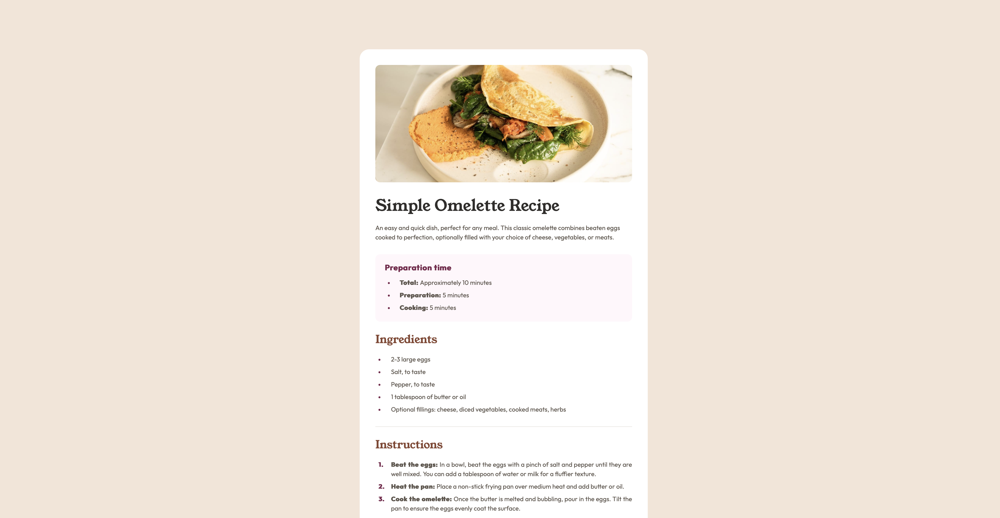
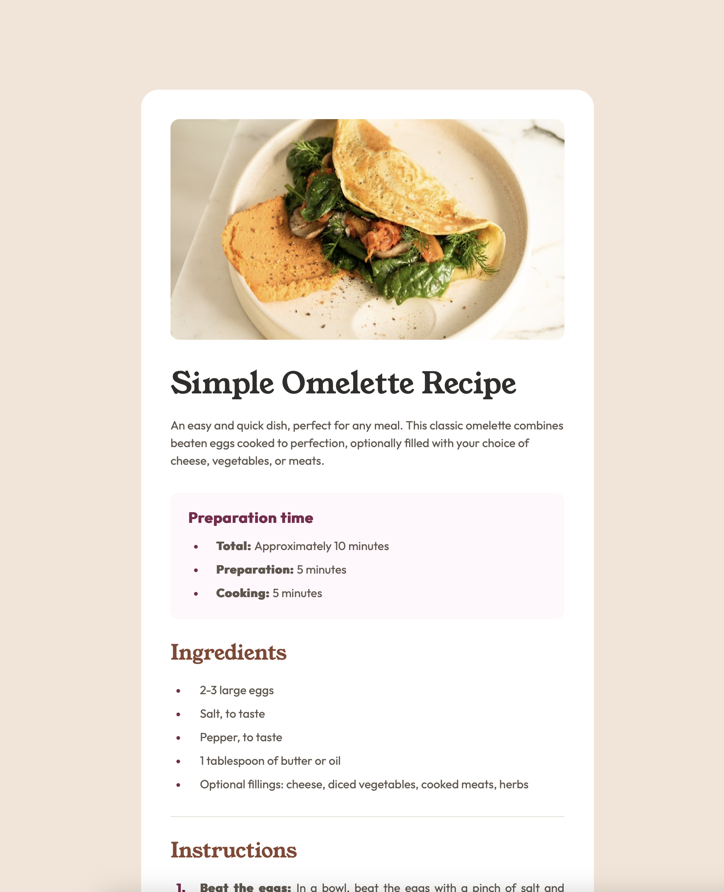
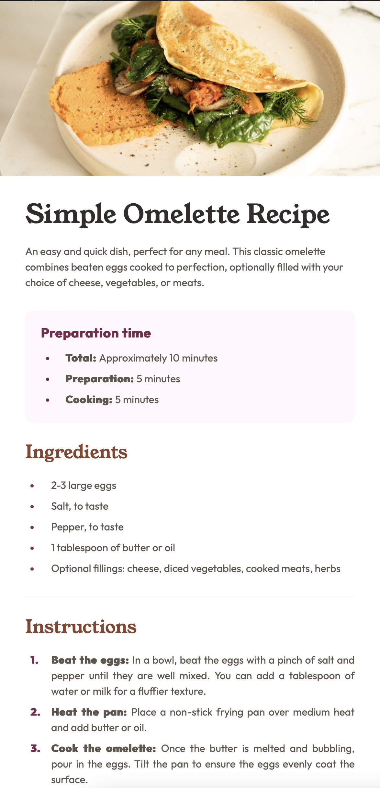

# Frontend Mentor - Recipe page solution

This is a solution to the [Recipe page challenge on Frontend Mentor](https://www.frontendmentor.io/challenges/recipe-page-KiTsR8QQKm). Frontend Mentor challenges help you improve your coding skills by building realistic projects. 

## Table of contents

- [Screenshot](#screenshot)
- [Links](#links)
- [Built with](#built-with)
- [Author](#author)

### Screenshot

Desktop view

Tablet view

Mobile view

### Links

- Solution URL: [My GitHub repo solution](https://github.com/kuba-guzynski/recipe-page-main-FrontendMentorProject)
- Live Site URL: [Live site URL](https://kuba-guzynski.github.io/recipe-page-main-FrontendMentorProject/)

### Built with

- Semantic HTML5 markup
- CSS custom properties
- Flexbox
- CSS Grid
- Mobile-first workflow

## Author

- Frontend Mentor - [@kuba-guzynski](https://www.frontendmentor.io/profile/kuba-guzynski)

